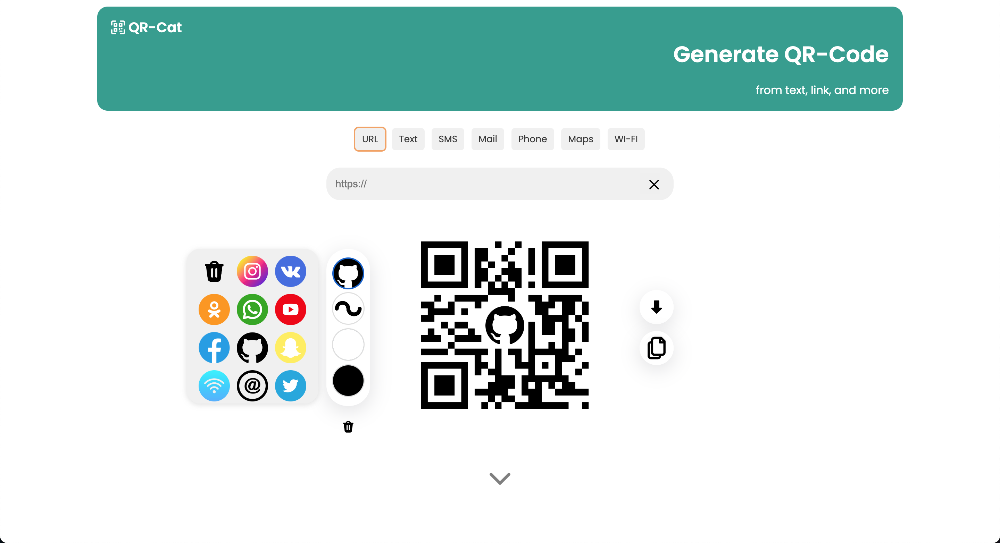

# QRCode
An open source QR code generation website. It is possible to use one code, other fills, a logo in the interior and the addition of pixels  

The site uses the Jquery module https://github.com/lrsjng/jquery-qrcode, many thanks to the authors of this module.
